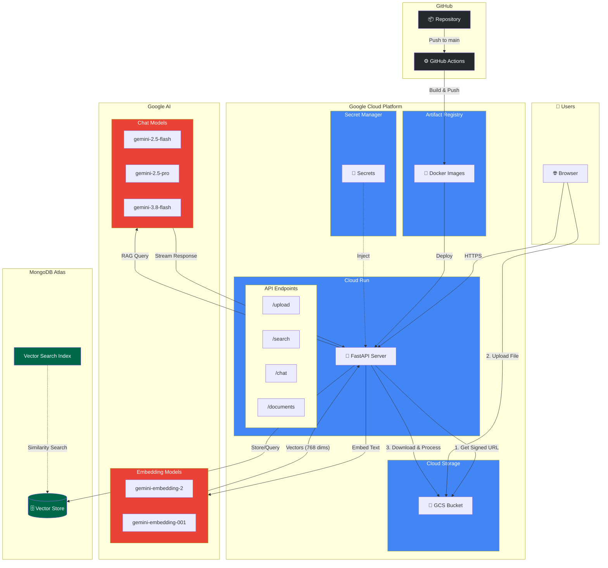

# RAG Agent

A Retrieval-Augmented Generation (RAG) service that enables document Q&A. Upload documents (PDF, TXT, DOCX), embed them using Google's Gemini embedding models, store vectors in MongoDB Atlas, and chat with your documents using Gemini LLMs.

## Architecture



### System Components

| Component | Service | Purpose |
|-----------|---------|---------|
| **Web Server** | Cloud Run | Hosts FastAPI application |
| **File Storage** | GCS Bucket | Temporary storage for uploaded documents |
| **Vector Database** | MongoDB Atlas | Stores embeddings with vector search |
| **Embeddings** | Gemini API | Converts text to vector embeddings |
| **Chat/LLM** | Gemini API | Generates responses for RAG queries |
| **Secrets** | Secret Manager | Stores API keys and connection strings |
| **CI/CD** | GitHub Actions | Automated testing and deployment |
| **Container Registry** | Artifact Registry | Stores Docker images |

## Features

- **Document Upload**: Upload PDF, TXT, DOCX files via GCS signed URLs
- **Multiple Embedding Models**: Support for `gemini-embedding-2` (multimodal) and `gemini-embedding-001` (text-only)
- **Vector Search**: Semantic search across embedded documents with model filtering
- **Chat with Documents**: RAG-powered Q&A with streaming responses using Gemini LLMs
- **Document Management**: View, filter by model, and delete documents
- **Session Memory**: Chat history maintained per session

## API Endpoints

### Core Endpoints

| Endpoint | Method | Description |
|----------|--------|-------------|
| `/` | GET | Web UI |
| `/health` | GET | Health check (add `?details=true` for component status) |
| `/docs` | GET | OpenAPI documentation |

### API v1

| Endpoint | Method | Description |
|----------|--------|-------------|
| `/api/v1/version` | GET | Version info |
| `/api/v1/models` | GET | List embedding models |
| `/api/v1/chat-models` | GET | List chat models |
| `/api/v1/documents` | GET | List documents (optional `?model=` filter) |
| `/api/v1/documents/{id}` | DELETE | Delete a document |
| `/api/v1/document-models` | GET | List unique models used in documents |
| `/api/v1/upload/signed-url` | POST | Get signed URL for GCS upload |
| `/api/v1/embed-from-gcs` | POST | Embed document from GCS |
| `/api/v1/search` | POST | Vector search |
| `/api/v1/chat` | POST | Chat with documents (streaming NDJSON) |

## Data Flow

### Upload Flow
```
File → GCS Signed URL → Upload to GCS → Embed from GCS → Chunk → Embed → Store in MongoDB
```

### Search Flow
```
Query → Embed Query → Vector Search (MongoDB) → Return Results with Scores
```

### Chat Flow
```
Message → Embed Query → Retrieve Top-K Docs → Build Prompt → Stream LLM Response
```

## Environment Variables

| Variable | Required | Description |
|----------|----------|-------------|
| `MONGODB_URI` | Yes | MongoDB Atlas connection string |
| `MONGODB_DATABASE` | No | Database name (default: `rag_agent`) |
| `MONGODB_COLLECTION` | No | Collection name (default: `documents`) |
| `MONGODB_INDEX_NAME` | No | Vector index name (default: `vector_index`) |
| `GEMINI_API_KEY` | Yes | Google AI API key |
| `GCS_BUCKET` | Yes | GCS bucket for file uploads |
| `LOG_LEVEL` | No | Logging level (default: `INFO`) |

## MongoDB Atlas Setup

Create a vector search index on your collection with this definition:

```json
{
  "fields": [
    {
      "type": "vector",
      "path": "embedding",
      "numDimensions": 768,
      "similarity": "cosine"
    },
    {
      "type": "filter",
      "path": "filename"
    },
    {
      "type": "filter",
      "path": "model"
    }
  ]
}
```

## Run Locally

```bash
# Set environment variables
export MONGODB_URI="mongodb+srv://..."
export GEMINI_API_KEY="..."
export GCS_BUCKET="your-bucket"

# Install dependencies
pip install -r requirements.txt

# Run server
python app.py
```

Access at: `http://localhost:8080`

## Run Tests

```bash
pytest tests/ -v
```

## Docker

```bash
# Build
docker build -t rag-agent .

# Run
docker run -p 8080:8080 \
  -e MONGODB_URI="mongodb+srv://..." \
  -e GEMINI_API_KEY="..." \
  -e GCS_BUCKET="your-bucket" \
  rag-agent
```

## Embedding Models

| Model | ID | Description |
|-------|-----|-------------|
| Gemini Embedding 2 | `gemini-embedding-2` | Multimodal (text, image, video, audio, PDF), 768 dims |
| Gemini Embedding 001 | `gemini-embedding-001` | Text-only, 768 dims |

## Chat Models

| Model | Description |
|-------|-------------|
| `gemini-2.5-flash` | Fast, efficient (default) |
| `gemini-2.5-pro` | More capable |
| `gemini-3.8-flash` | Latest flash model |

## Adding New Embedding Models

1. Create a new file in `embedders/` (e.g., `openai.py`)
2. Extend `GeminiEmbedderBase` or implement `BaseEmbedder`
3. Use `@register_embedder("model-name")` decorator
4. Import in `app.py` to register

## Project Structure

```
rag-agent/
├── app.py                 # FastAPI application
├── version.py             # Version info
├── embedders/
│   ├── base.py            # Base embedder & registry
│   └── gemini.py          # Gemini embedding models
├── storages/
│   ├── base.py            # Base storage & registry
│   └── mongodb.py         # MongoDB Atlas storage
├── services/
│   ├── document.py        # Document processing
│   └── gcs.py             # GCS operations
├── rag/
│   ├── pipeline.py        # Haystack RAG pipeline
│   ├── components.py      # Custom Haystack components
│   └── session.py         # Chat session memory
├── utils/
│   ├── exceptions.py      # Custom exceptions
│   └── retry.py           # Retry utilities
├── static/                # Frontend assets
│   ├── index.html
│   ├── css/styles.css
│   └── js/
│       ├── app.js
│       ├── api.js
│       └── components/
└── tests/
    └── test_app.py
```
